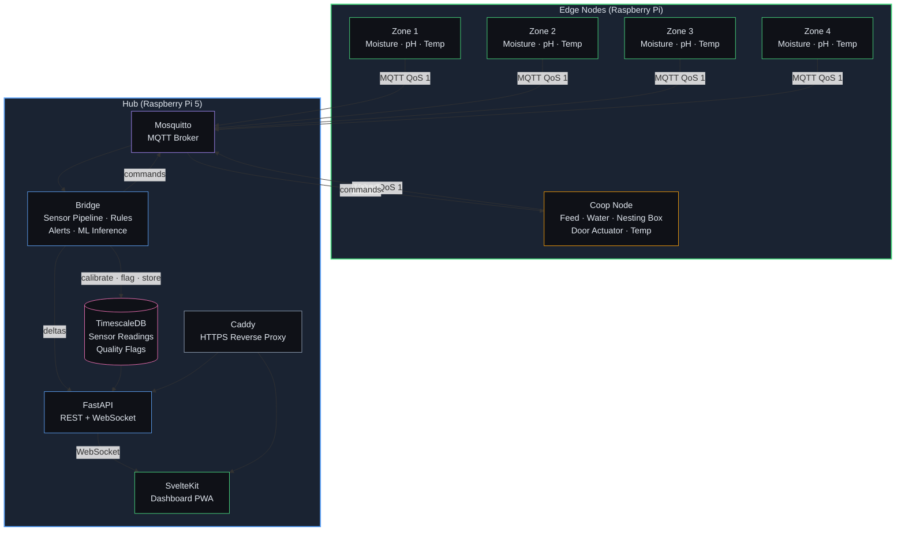
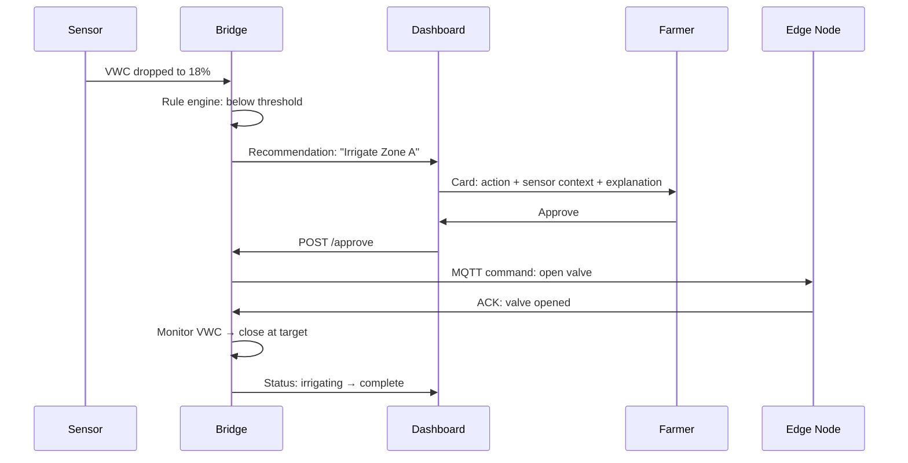
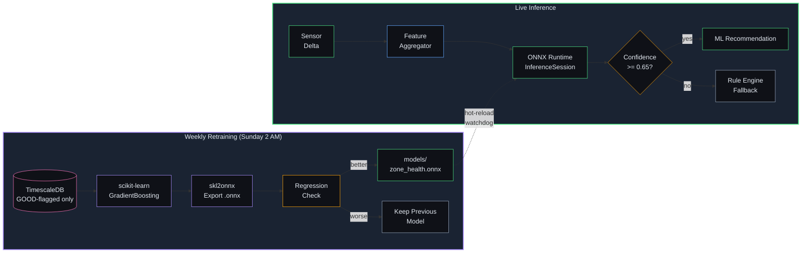

# Backyard Farm Platform

A self-hosted, local-only platform for managing a medium-scale backyard farm — multiple garden zones and a chicken flock. Distributed edge nodes collect sensor data, a central hub runs ML-based inference and serves the dashboard, and the farmer monitors everything from a single PWA.

**No cloud. No subscriptions. Your data stays on your network.**

### What you get

- **Real-time dashboard** — soil moisture, pH, temperature, flock health, and coop status on one screen
- **ML-powered recommendations** — ONNX models learn your farm and suggest actions; you approve before anything happens
- **Automated coop** — sunrise/sunset door, stuck detection, egg counting via nesting box weight sensor
- **Smart irrigation** — sensor-feedback loops that stop watering when moisture hits the target
- **Push notifications** — self-hosted ntfy integration sends alerts to your phone
- **pH calibration tracking** — overdue reminders, one-tap recording, per-sensor offset management
- **Complete hardware guide** — shopping list with exact parts, wiring diagrams, and smoke tests for every subsystem
- **Interactive tutorial** — step-by-step onboarding walks you through first boot to daily operation
- **Full reference docs** — every screen, config option, alert type, and failure mode documented

### What it costs

~$742 in hardware (4 garden zones + coop + hub). See the [full BOM](docs/hardware/bom.md) for exact parts and budget alternatives.

---

## Architecture



---

## Data Pipeline

Every sensor reading flows through a strict pipeline before reaching the dashboard:

```mermaid
flowchart LR
    SENSOR["Sensor<br/>Reading"] --> BUFFER["SQLite<br/>Buffer"]
    BUFFER -->|MQTT QoS 1| PARSE["Pydantic<br/>Validate"]
    PARSE --> CAL["Apply<br/>Calibration"]
    CAL --> QF["Quality<br/>Flag"]
    QF --> STUCK["Stuck<br/>Detection"]
    STUCK --> TS["TimescaleDB<br/>INSERT"]
    TS --> EVAL["Rule Engine<br/>Alert Engine<br/>Health Score"]
    EVAL --> ONNX{"ONNX<br/>Inference?"}
    ONNX -->|ML mode| ML["ONNX Runtime<br/>Predict"]
    ONNX -->|Rules mode| RULES["Threshold<br/>Logic"]
    ML --> WS["WebSocket<br/>Broadcast"]
    RULES --> WS

    style SENSOR fill:#0f1117,stroke:#4ade80,color:#e2e8f0
    style BUFFER fill:#0f1117,stroke:#f59e0b,color:#e2e8f0
    style PARSE fill:#0f1117,stroke:#60a5fa,color:#e2e8f0
    style CAL fill:#0f1117,stroke:#60a5fa,color:#e2e8f0
    style QF fill:#0f1117,stroke:#a78bfa,color:#e2e8f0
    style STUCK fill:#0f1117,stroke:#a78bfa,color:#e2e8f0
    style TS fill:#0f1117,stroke:#f472b6,color:#e2e8f0
    style EVAL fill:#0f1117,stroke:#60a5fa,color:#e2e8f0
    style ONNX fill:#0f1117,stroke:#f59e0b,color:#e2e8f0
    style ML fill:#0f1117,stroke:#4ade80,color:#e2e8f0
    style RULES fill:#0f1117,stroke:#94a3b8,color:#e2e8f0
    style WS fill:#0f1117,stroke:#4ade80,color:#e2e8f0
```



**Quality flags** are applied at ingestion — every reading is tagged `GOOD`, `SUSPECT`, or `BAD` based on range checks. Only `GOOD`-flagged data is used for ML model training.

---

## Recommend-and-Confirm

The core UX pattern: the system proposes actions, the farmer decides.



ML models (Phase 4) produce recommendations through the same queue — the farmer's experience is identical whether recommendations come from threshold rules or trained ONNX models.

---

## Dashboard

| Screen | Route | What it shows |
|--------|-------|---------------|
| **Home** | `/` | Unified overview — zone health cards, flock summary, ML model status, alert bar |
| **Zones** | `/zones` | All zones with live sensor values, health badges, system health panel |
| **Zone Detail** | `/zones/[id]` | Single zone: live readings, irrigation controls, 7/30-day charts, inline pH calibration |
| **Coop** | `/coop` | Door status + controls, egg count, production chart, feed/water levels |
| **Settings: AI** | `/settings/ai` | Per-domain ML/Rules toggle, model maturity progress |
| **Settings: Calibration** | `/settings/calibration` | pH sensor list with overdue badges, record calibration, edit offsets |
| **Settings: Notifications** | `/settings/notifications` | ntfy server URL, topic, enable/disable, Send Test |
| **Settings: Storage** | `/settings/storage` | Per-table sizes from TimescaleDB, manual purge with confirmation |
| **Tutorial** | `/tutorial` | 8-step interactive onboarding wizard (auto-launches on first visit) |

---

## Tech Stack

| Layer | Technology | Purpose |
|-------|-----------|---------|
| **Edge Nodes** | Raspberry Pi Zero 2W, Python 3.12, paho-mqtt | Sensor polling, SQLite buffer, local emergency rules |
| **Coop Node** | Raspberry Pi 5, L298N, HX711, DS18B20 | Door actuator, load cells, limit switches, temperature |
| **Hub** | Raspberry Pi 5 (8GB), Docker Compose | Runs all hub services |
| **Broker** | Mosquitto 2.1 | MQTT messaging with per-node ACL credentials |
| **Database** | TimescaleDB 2.26 (PG 17) | Hypertable for sensor readings, continuous aggregates, retention policies |
| **Bridge** | Python 3.12, aiomqtt, asyncpg | Sensor pipeline, calibration, quality flags, rules, alerts, ML inference, ntfy dispatch |
| **API** | FastAPI 0.135, Uvicorn | REST endpoints, WebSocket real-time updates |
| **ML Inference** | ONNX Runtime 1.23, scikit-learn | Gradient boosting classifiers for zone health, irrigation, flock anomaly |
| **Dashboard** | SvelteKit 2.21, Svelte 5 | PWA with real-time WebSocket, uPlot charts, Lucide icons |
| **Proxy** | Caddy | HTTPS termination, reverse proxy (required for PWA on iOS) |
| **Docs** | MkDocs + Material | Auto-built reference documentation from Markdown |

---

## ML Engine

Three ONNX models (scikit-learn gradient boosting classifiers) replace rule-based threshold logic behind the same recommend-and-confirm UX. This is classical machine learning on structured tabular sensor data — not LLMs or generative AI.



| Domain | Inference Interval | Training Data Window |
|--------|-------------------|---------------------|
| Zone Health | Every 15 minutes | 24 hours |
| Irrigation | Every 1 hour | 24 hours |
| Flock Anomaly | Every 30 minutes | 7 days |

The farmer can toggle each domain between ML and Rules independently from `/settings/ai`. During cold start (< 4 weeks of data), rule-based threshold logic runs automatically.

---

## Getting Started

### Prerequisites

- Raspberry Pi 5 (8GB) for the hub
- Raspberry Pi Zero 2W for each garden zone (up to 4)
- Raspberry Pi 5 (4GB) for the coop node
- Sensors, relays, and wiring per the [hardware guide](docs/hardware/README.md)

### Quick Start

```bash
# Clone the repo
git clone https://github.com/synaesthetik/backyard-farm.git
cd backyard-farm

# One-command setup: MQTT credentials, stack build, data seeding
cd hub && bash dev-init.sh

# Dashboard is at https://localhost:8443
# Interactive tutorial auto-launches on first visit
```

`dev-init.sh` handles everything: generates MQTT credentials, starts Docker Compose, runs database migrations, seeds zone configuration and 6 weeks of synthetic sensor data, and trusts the Caddy local CA certificate.

### Hardware Assembly

Follow the [hardware documentation](docs/hardware/README.md) in build order:

1. [Hub Assembly](docs/hardware/hub.md) — Pi 5, network, Docker
2. [Power Distribution](docs/hardware/power.md) — 12V outdoor wiring, buck converters
3. [Garden Node](docs/hardware/garden-node.md) — Pi Zero 2W, moisture/pH/temp sensors
4. [Irrigation](docs/hardware/irrigation.md) — relay board, solenoid valves
5. [Coop Node](docs/hardware/coop-node.md) — door actuator, limit switches, load cells

Each guide includes a wiring diagram, pin mapping table, smoke test, and common mistakes section.

---

## Development

```bash
# Start hub services
cd hub && docker compose up -d

# Dashboard dev server (hot reload)
cd hub/dashboard && npm run dev

# Run tests
cd hub/bridge && python -m pytest tests/ -v        # 144 Python tests
cd hub/dashboard && npx vitest run                  # 94 component tests

# Generate synthetic sensor data (for development without hardware)
DB_HOST=localhost python scripts/generate_synthetic_data.py --weeks 6 --zones "zone-01,zone-02,zone-03,zone-04"

# Production build
cd hub/dashboard && npm run build
```

---

## Documentation

```bash
make docs          # Build reference docs to site/
make docs-serve    # Serve docs locally at http://127.0.0.1:8000
make docs-clean    # Remove built site/ directory
```

Requires Python 3 and pip. MkDocs and Material theme are installed automatically from `requirements-docs.txt`.

**Reference docs** cover every dashboard screen, configuration option, alert type, and automation rule. **Troubleshooting guide** covers the 20 most common failure modes with diagnostic steps and resolution.

Full documentation source is in the [`docs/`](docs/) directory. Hardware documentation is in [`docs/hardware/`](docs/hardware/README.md).

---

## MQTT Topic Schema

```
farm/{node_id}/sensors/{sensor_type}    # Sensor readings (QoS 1)
farm/{node_id}/heartbeat                # Node liveness (QoS 1, retain)
farm/{node_id}/commands/{command_type}  # Actuator commands (hub -> edge)
farm/{node_id}/ack/{command_id}         # Command acknowledgments (edge -> hub)
```

Each node has dedicated MQTT credentials with ACL scoped to `farm/{node_id}/#`. The hub bridge subscribes to `farm/#` with read/write access to all topics.

---

## Database Schema

| Table | Type | Purpose |
|-------|------|---------|
| `sensor_readings` | Hypertable | All sensor data with quality flags and calibration |
| `sensor_readings_hourly` | Continuous aggregate | Hourly rollups (avg/min/max) for long-term trends |
| `node_heartbeats` | Hypertable | Edge node liveness tracking |
| `calibration_offsets` | Regular | Per-sensor calibration offsets + last calibration date |
| `zone_config` | Regular | Per-zone thresholds and plant metadata |
| `flock_config` | Regular | Breed, hatch date, flock size, lighting |
| `egg_counts` | Regular | Daily estimated egg counts from nesting box sensor |
| `feed_daily_consumption` | Regular | Daily feed weight delta with refill detection |

**Retention policies:** Raw sensor data is automatically purged after 90 days. Hourly rollups are retained for 2 years.

---

## Design Principles

- **Local-only** — No cloud APIs, no external inference, no recurring costs. All data and ML processing stays on-premises.
- **Recommend-and-confirm** — The system proposes, the farmer decides. No fully autonomous actions in v1.
- **Sensor-based** — Plant health from soil sensors, not cameras. Flock health from weight sensors and production models.
- **Hardware-agnostic** — Pluggable sensor adapters. Calibration at the hub, not the edge.
- **Graceful degradation** — Edge nodes buffer locally during hub outages. Stale data is shown with visual indicators, never hidden. ML models fall back to threshold rules when confidence is low.

---

## Project Status

v1.0 milestone complete. All 7 phases delivered:

| Phase | What it delivers |
|-------|-----------------|
| 1. Hardware Foundation + Sensor Pipeline | Sensor data flowing with quality flags, stuck detection, node health |
| 2. Actuator Control + Dashboard V1 | Irrigation, coop door, recommendations, alerts, PWA |
| 3. Flock Management + Unified Dashboard | Egg tracking, production model, feed consumption, overview screen |
| 4. ONNX ML Layer | ML-backed recommendations, model maturity, ML/Rules toggle |
| 5. Operational Hardening | pH calibration, push notifications (ntfy), data retention |
| 6. Hardware Shopping List | Complete BOM, wiring diagrams, smoke test procedures |
| 7. Tutorial + User Docs | Interactive tutorial, reference docs, troubleshooting guide |
