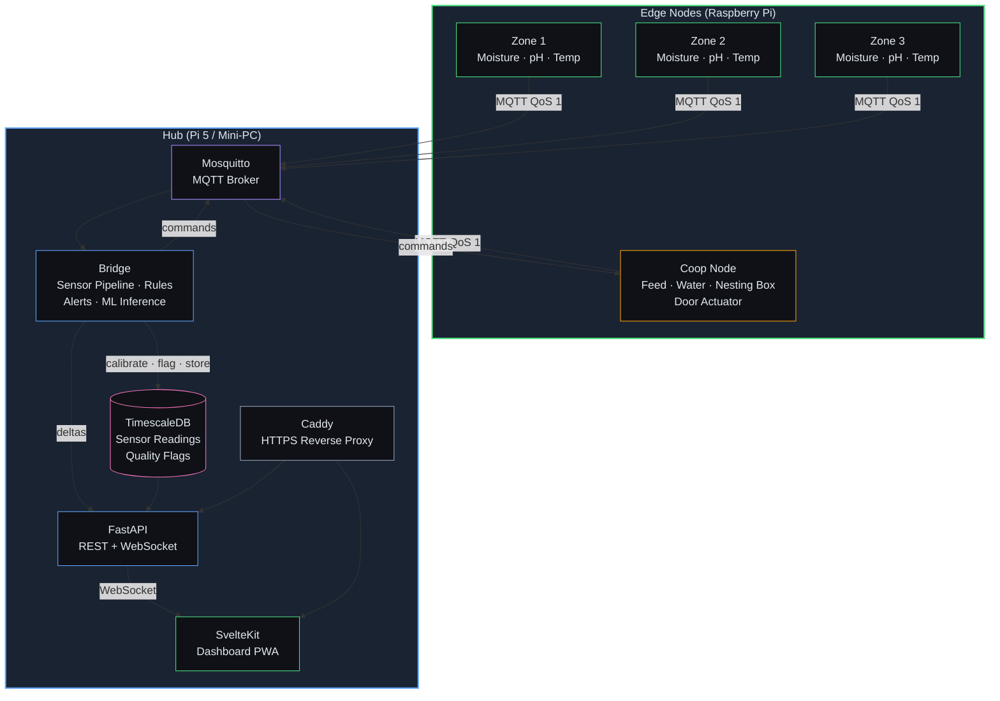
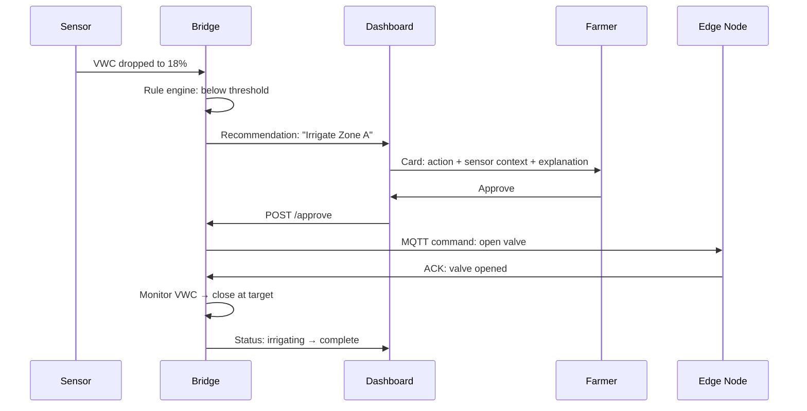
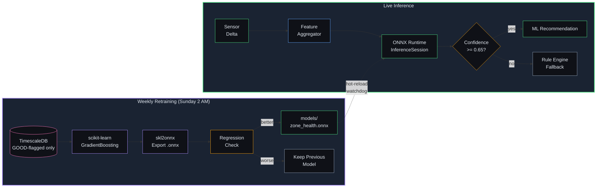

# A special backyard farm platform catered specifically to me

A self-hosted, local-only platform for managing a medium-scale backyard farm — multiple garden zones and a chicken flock. Distributed edge nodes collect sensor data, a central hub runs ML-based inference and serves the dashboard, and the farmer monitors everything from a single PWA.

**No cloud. No subscriptions. Your data stays on your network.**

---

## Architecture



---

## Data Pipeline

Every sensor reading flows through a strict pipeline before reaching the dashboard:

```mermaid
flowchart LR
    SENSOR["Sensor<br/>Reading"] --> BUFFER["SQLite<br/>Buffer"]
    BUFFER -->|MQTT QoS 1| PARSE["Pydantic<br/>Validate"]
    PARSE --> CAL["Apply<br/>Calibration"]
    CAL --> QF["Quality<br/>Flag"]
    QF --> STUCK["Stuck<br/>Detection"]
    STUCK --> TS["TimescaleDB<br/>INSERT"]
    TS --> EVAL["Rule Engine<br/>Alert Engine<br/>Health Score"]
    EVAL --> ONNX{"ONNX<br/>Inference?"}
    ONNX -->|ML mode| ML["ONNX Runtime<br/>Predict"]
    ONNX -->|Rules mode| RULES["Threshold<br/>Logic"]
    ML --> WS["WebSocket<br/>Broadcast"]
    RULES --> WS

    style SENSOR fill:#0f1117,stroke:#4ade80,color:#e2e8f0
    style BUFFER fill:#0f1117,stroke:#f59e0b,color:#e2e8f0
    style PARSE fill:#0f1117,stroke:#60a5fa,color:#e2e8f0
    style CAL fill:#0f1117,stroke:#60a5fa,color:#e2e8f0
    style QF fill:#0f1117,stroke:#a78bfa,color:#e2e8f0
    style STUCK fill:#0f1117,stroke:#a78bfa,color:#e2e8f0
    style TS fill:#0f1117,stroke:#f472b6,color:#e2e8f0
    style EVAL fill:#0f1117,stroke:#60a5fa,color:#e2e8f0
    style ONNX fill:#0f1117,stroke:#f59e0b,color:#e2e8f0
    style ML fill:#0f1117,stroke:#4ade80,color:#e2e8f0
    style RULES fill:#0f1117,stroke:#94a3b8,color:#e2e8f0
    style WS fill:#0f1117,stroke:#4ade80,color:#e2e8f0
```



**Quality flags** are applied at ingestion — every reading is tagged `GOOD`, `SUSPECT`, or `BAD` based on range checks. Only `GOOD`-flagged data is used for ML model training.

---

## Recommend-and-Confirm

The core UX pattern: the system proposes actions, the farmer decides.



ML models (Phase 4) produce recommendations through the same queue — the farmer's experience is identical whether recommendations come from threshold rules or trained ONNX models.

---

## Dashboard Tabs

| Tab | Route | What it shows |
|-----|-------|---------------|
| **Home** | `/` | Unified overview — zone health cards + flock summary + ML model status |
| **Zones** | `/zones` | All zones with sensor values, health badges, system health panel |
| **Zone Detail** | `/zones/[id]` | Single zone: live readings, irrigation controls, 7/30-day charts |
| **Coop** | `/coop` | Door status + controls, egg count, production chart, feed sparkline |
| **Recommendations** | `/recommendations` | Pending actions with approve/reject + ML/Rules source badge |
| **ML Settings** | `/settings/ai` | Per-domain ML/Rules toggle, model maturity progress |

---

## Tech Stack

| Layer | Technology | Purpose |
|-------|-----------|---------|
| **Edge** | Python 3.12, paho-mqtt | Sensor polling, SQLite buffer, local emergency rules |
| **Broker** | Mosquitto 2.1 | MQTT messaging with per-node ACL credentials |
| **Database** | TimescaleDB 2.26 (PG 17) | Hypertable for sensor readings, quality flags, time-bucketed queries |
| **Bridge** | Python 3.12, aiomqtt, asyncpg | Sensor pipeline, calibration, quality flags, rules, alerts, ML inference |
| **API** | FastAPI 0.135, Uvicorn | REST endpoints, WebSocket real-time updates |
| **ML Inference** | ONNX Runtime 1.23, scikit-learn | Gradient boosting classifiers for zone health, irrigation, flock anomaly — not LLMs |
| **Scheduling** | APScheduler 3.11 | Periodic inference (15m/1h/30m) + weekly model retraining |
| **Dashboard** | SvelteKit 2.21, Svelte 5 | PWA with real-time WebSocket, uPlot charts, Lucide icons |
| **Proxy** | Caddy | HTTPS termination, reverse proxy (required for PWA on iOS) |

---

## Project Structure

```
backyard-farm/
├── edge/
│   └── daemon/                  # Edge node sensor daemon
│       ├── main.py              # Polling loop, MQTT publish, buffer flush
│       ├── sensors.py           # DS18B20, ADS1115 pH, moisture drivers
│       ├── buffer.py            # SQLite store-and-forward (INFRA-03)
│       ├── rules.py             # Emergency shutoff, coop hard-close
│       └── tests/
├── hub/
│   ├── docker-compose.yml       # All hub services
│   ├── init-db.sql              # TimescaleDB schema
│   ├── bridge/                  # MQTT bridge + sensor pipeline
│   │   ├── main.py              # Async pipeline: validate → calibrate → flag → store → evaluate
│   │   ├── quality.py           # GOOD / SUSPECT / BAD flagging
│   │   ├── calibration.py       # Per-sensor offset application
│   │   ├── rule_engine.py       # Threshold recommendations + dedup + back-off
│   │   ├── alert_engine.py      # Threshold crossing with hysteresis
│   │   ├── health_score.py      # Composite zone health (green/yellow/red)
│   │   ├── production_model.py  # Expected egg production (breed × age × daylight)
│   │   ├── egg_estimator.py     # Nesting box weight → egg count
│   │   ├── feed_consumption.py  # Daily feed delta with refill detection
│   │   ├── inference/           # Phase 4: ONNX ML layer
│   │   │   ├── inference_service.py      # ONNX Runtime wrapper + hot-reload
│   │   │   ├── feature_aggregator.py     # Sensor window assembly (GOOD-flag SQL)
│   │   │   ├── inference_scheduler.py    # APScheduler: inference + weekly retraining
│   │   │   ├── model_watcher.py          # Watchdog: .onnx file hot-reload
│   │   │   ├── maturity_tracker.py       # Per-domain recommendation tracking
│   │   │   ├── ai_settings.py            # AI/Rules toggle persistence
│   │   │   ├── training/                 # scikit-learn → ONNX export pipelines
│   │   │   │   ├── train_zone_health.py
│   │   │   │   ├── train_irrigation.py
│   │   │   │   └── train_flock_anomaly.py
│   │   │   └── synthetic/                # Realistic test data generator
│   │   └── tests/
│   ├── api/                     # FastAPI REST + WebSocket server
│   │   ├── main.py              # Server, DB pool, WebSocket /ws/dashboard
│   │   ├── actuator_router.py   # Irrigation valve + coop door commands
│   │   ├── recommendation_router.py  # Approve/reject → bridge proxy
│   │   ├── history_router.py    # Time-bucketed sensor history
│   │   ├── flock_router.py      # Flock config, egg history, refresh
│   │   └── inference_settings_router.py  # AI/Rules toggle + maturity endpoints
│   ├── dashboard/               # SvelteKit PWA
│   │   └── src/
│   │       ├── lib/
│   │       │   ├── ws.svelte.ts          # Reactive WebSocket store
│   │       │   ├── ZoneCard.svelte       # Zone sensor display + health badge
│   │       │   ├── CoopPanel.svelte      # Door, eggs, feed, production chart
│   │       │   ├── AIStatusCard.svelte   # Model maturity progress per domain
│   │       │   ├── AISettingsToggle.svelte  # Per-domain AI/Rules switch
│   │       │   ├── RecommendationCard.svelte  # Approve/reject + source badge
│   │       │   └── ...
│   │       └── routes/
│   │           ├── +page.svelte          # Home: overview
│   │           ├── zones/                # Zone list + detail
│   │           ├── coop/                 # Coop panel + settings
│   │           ├── recommendations/      # Recommendation queue
│   │           ├── settings/ai/          # AI engine settings
│   │           └── tutorial/             # Interactive onboarding wizard (steps 1–8)
│   └── models/                  # .onnx model files (git-ignored, populated by training)
├── config/
│   └── hub.env                  # Environment configuration
├── docs/
│   └── mqtt-topic-schema.md     # MQTT topic hierarchy + payloads
└── scripts/
    └── generate_synthetic_data.py  # Seed TimescaleDB with realistic test data
```

---

## MQTT Topic Schema

```
farm/{node_id}/sensors/{sensor_type}    # Sensor readings (QoS 1)
farm/{node_id}/heartbeat                # Node liveness (QoS 1, retain)
farm/{node_id}/commands/{command_type}  # Actuator commands (hub → edge)
farm/{node_id}/ack/{command_id}         # Command acknowledgments (edge → hub)
```

Each node has dedicated MQTT credentials with ACL scoped to `farm/{node_id}/#`. The hub bridge subscribes to `farm/#` with read/write access to all topics.

---

## ML Engine (Phase 4)

Three ONNX models (scikit-learn gradient boosting classifiers) replace rule-based threshold logic behind the same recommend-and-confirm UX. This is classical machine learning on structured tabular sensor data — not LLMs or generative AI.



| Domain | Inference Interval | Training Data Window |
|--------|-------------------|---------------------|
| Zone Health | Every 15 minutes | 24 hours |
| Irrigation | Every 1 hour | 24 hours |
| Flock Anomaly | Every 30 minutes | 7 days |

The farmer can toggle each domain between ML and Rules independently from `/settings/ai`. During cold start (< 4 weeks of data), rule-based threshold logic runs automatically.

---

## Database Schema

| Table | Type | Purpose |
|-------|------|---------|
| `sensor_readings` | Hypertable | All sensor data with quality flags and calibration |
| `node_heartbeats` | Hypertable | Edge node liveness tracking |
| `calibration_offsets` | Regular | Per-sensor calibration offsets (applied at ingestion) |
| `zone_config` | Regular | Per-zone thresholds and plant metadata |
| `flock_config` | Regular | Breed, hatch date, flock size, lighting |
| `egg_counts` | Regular | Daily estimated egg counts from nesting box sensor |
| `feed_daily_consumption` | Regular | Daily feed weight delta with refill detection |
| `model_maturity` | Regular | Per-domain recommendation counts and approval rates |

---

## Design Principles

- **Local-only** — No cloud APIs, no external inference, no recurring costs. All data and ML processing stays on-premises.
- **Recommend-and-confirm** — The system proposes, the farmer decides. No fully autonomous actions in v1.
- **Sensor-based** — Plant health from soil sensors, not cameras. Flock health from weight sensors and production models.
- **Hardware-agnostic** — Pluggable sensor adapters. Calibration at the hub, not the edge.
- **Graceful degradation** — Edge nodes buffer locally during hub outages. Stale data is shown with visual indicators, never hidden. ML models fall back to threshold rules when confidence is low.

---

## Development

```bash
# Start hub services
cd hub && docker compose up -d

# Dashboard dev server (hot reload)
cd hub/dashboard && npm run dev

# Run tests
cd hub/bridge && python -m pytest tests/ -v        # 125 Python tests
cd hub/dashboard && npx vitest run                  # 75 component tests

# Generate synthetic sensor data (for development without hardware)
python scripts/generate_synthetic_data.py --weeks 6

# Production build
cd hub/dashboard && npm run build
```

---

## Roadmap

| Phase | Status | What it delivers |
|-------|--------|-----------------|
| 1. Hardware Foundation + Sensor Pipeline | Complete | Sensor data flowing with quality flags, stuck detection, node health |
| 2. Actuator Control + Dashboard V1 | Complete | Irrigation, coop door, recommendations, alerts, PWA |
| 3. Flock Management + Unified Dashboard | Complete | Egg tracking, production model, feed consumption, overview screen |
| 4. ONNX ML Layer | Complete | ML-backed recommendations, model maturity, ML/Rules toggle |
| 5. Operational Hardening | Planned | pH calibration, push notifications (ntfy), data retention |
| 6. Hardware Shopping List | Planned | Complete BOM, wiring diagrams, smoke test procedures |
| 7. Tutorial + User Docs | Planned | Interactive tutorial, reference docs, troubleshooting guide |
